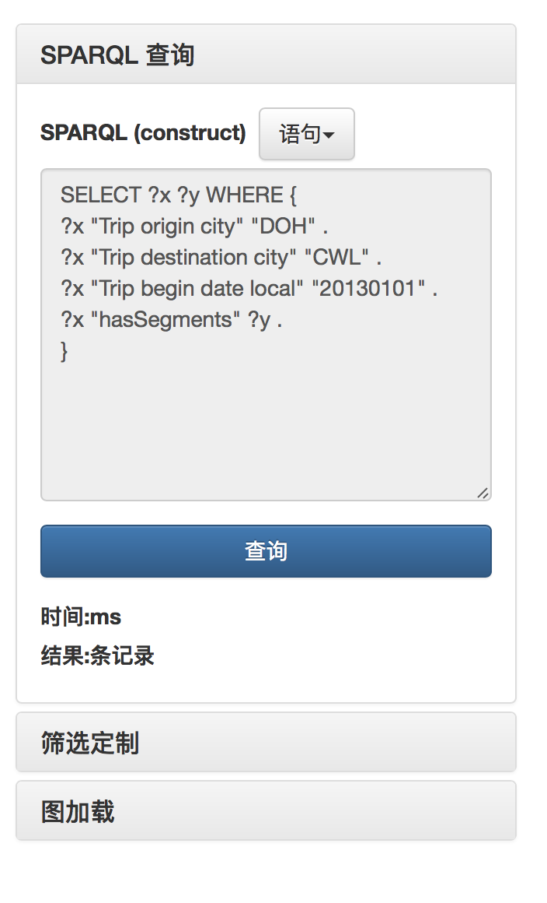

# RDFViz
RDF数据的可视化展示:可展示RDF之间的关系与联系、利用SPARQL语句查询不同的数据集、针对于RDF的标签化和TripleBit与其他图数据库性能对比。

关于系统的演示,可以访问这里进行查看[RDFViz](http://222.20.79.232:53000)
## RDF简介
RDF 是一个具有这些属性的 W3C 标准数据模型。这些实体使用了 URI（最好是可解析的 URL），并通过直接关系进行关联（而且也以这种方式进行标识）。

实体和关系都可以通过全球标识符进行引用，可以通过解析标示符来了解它们。如果我们将图形序列化成某种标准格式，那么我们将拥有完全便携的数据。

任何 RDF 系统都可以使用来自其他任何 RDF 系统的 RDF，无需进行任何类型的协调。

应用程序或用户可能不知道如何处理数据，但他们至少可以使用这些数据，然后查看摄入了哪些数据。
## TripleBit
由于RDF(Resource Description Framework)具有表达灵活、简洁等优点,已被接受为表达元数据及万维网上数据互联的规范.

近年来,其数据量以飞快的速度增长,相应地,要求存储RDF数据的系统应具有高扩展性.大规模RDF数据库系统TripleBit旨在为

大规模RDF数据提供一个高效的存储和查询方案.为尽可能降低存储空间消耗,采用了增量压缩和变长整数编码方法.并采用了

数据分块的存储方法,既使得存储管理方便又使得存储结构紧凑,加速了数据读取.系统提供了基于启发式规则的动态查询计划生成方法.

所产生的查询计划在执行过程中根据中间结果会相应作调整,以保持最优的执行顺序.对于多变量的查询,使用二步执行策略以减少查询过程

中产生的中间结果.与当前著名系统RDF 3X相比,TripleBit具有较好的性能.

关于TripleBit的相关论文可以查看http://grid.hust.edu.cn/triplebit
## RDF数据可视化的展示效果如下

## SPARQL语句
SPARQL 建立在多项关键技术的基础之上，就像 HTTP 和 HTML（万维网的基础）依赖于 TCP/IP 这样的更深和更低层系统一样。

在介绍 SPARQL 之前首先看看一些重要的标准，它们为什么存在，对于语义 Web 开发人员来说意味着什么。

1997 年，Tim Berners-Lee 指出 HTML 和万维网存在着局限性。其设计的目标不是动态 Web 应用程序，更不用说现在的复杂分布式系统了。

HTML 和 HTTP 仅仅是迈向更远大的目标 —— 机器与机器之间的半自动通信 —— 的（重要的）一步，对于我们来说就像只有 FTP 时的 WWW 一样。

实现这个目标的基础是 RDF（资源描述框架）。

## 查询结果展示

